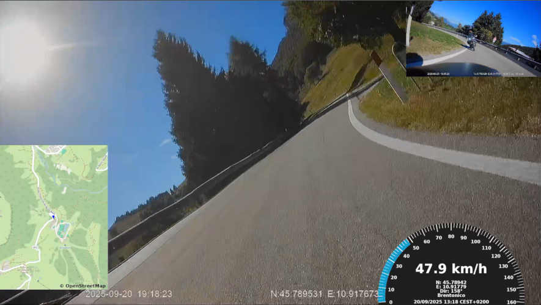

# Midland BikePlay Guardian video merger

## Generic info

This project aims to provide an automated way to merge front and rear videos captured with the Midland's BikePlay Guardian device.

It can be probably used for all the devices that save the MPEGTS segments in the same way, i.e.

- Videos split in _F.ts and _R.ts
- .ts files have the stream #2 as binary, that is the GPS track information, saved in a fixed-size text-based format, starting with "Viidure", with the following pattern:
    ```Viidure{datetime in format YYYY/MM/DD HH:MM:SS} N:{latitude} E:{longitude} {speed} {speed unit} {hdop} {height} {satellites} x:{accelerometer x} y:{accelerometer y} z:{accelerometer z}```
    For example:
    ```Viidure2025/17/09 18:00:03 N:0.00 E:0.00 23.1 km/h 0.5 115.1 10 x:-1 y:-1 z:-1```

## Technical info & requirements

- Python 3.13
- ffmpeg (better if compiled with CUDA support, if you have an nvidia GPU) -> see [this gist](https://gist.github.com/elegos/7d9349a417e6a135c97884d0d4f65230) to make ffmpeg compatible with CUDA SDK 13 (the current one)
- Tested in a Linux environment

It will try to use CUDA-enabled npp filters, if available, or will fallback to CPU-bound ones otherwise (way slower).

The output video will be encoded in HEVC / AAC. The video codec will once again use the nvidia's nvenc if available, or libx265 otherwise.

## Copyright info

The project is released under the GNU GPL v3.

It uses the DejaVu Sans Bold font, which is a copyright of Bitstream.

The project also uses OpenStreetMap to download the maps for the GPS track video.

## Example output

### Output frame example


### Output frame example with --gps-overlay=tachometer


## How to use

```bash
# First time only
pipenv install

pipenv run python ./convert.py [--gps-overlay=tachometer] folder-where-all-files-are-stored
```

It will:
- create different folders for front videos, rear videos, jpeg still frames
- extract the gpx information out of all front (*_F.ts) files and save it
- generate the OpenStreetMap video based on the gpx information
- (optionally) generate a tachometer-style overlay at the bottom right with GPS info, including speed, GPS coordinates, direction degrees, the city / town / village / hamlet / municipality and the datetime, at the given time zone, 
- merge all the front videos, embedding (via Picture in Picture) both the rear videos and the OSM video previously made

### Available options
```bash
pipenv run python ./convert.py --help                             
usage: convert.py [-h] [--debug] [--window-width WINDOW_WIDTH] [--window-height WINDOW_HEIGHT] [--gps-overlay {tachometer}] [--timezone TIMEZONE] input_folder

positional arguments:
  input_folder          Path to the input folder containing .jpg and .ts files

options:
  -h, --help            show this help message and exit
  --debug               Enable debug logging
  --window-width WINDOW_WIDTH
                        Width of the Open Street Map GPS track window
  --window-height WINDOW_HEIGHT
                        Height of the Open Street Map GPS track window
  --gps-overlay {tachometer}
  --timezone TIMEZONE
```
